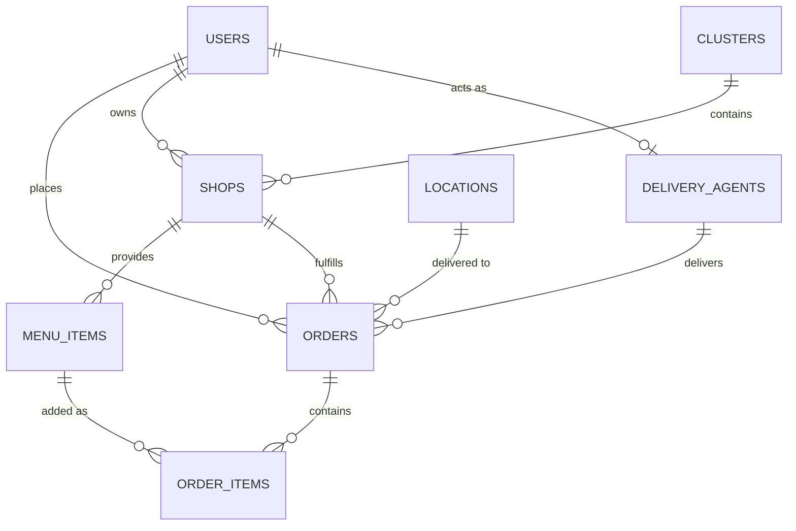

# Database Schema

CampusServe uses SQLite with `better-sqlite3` and WAL mode enabled for performance.

### Core Tables:

- **Users**: Phone-based identity, defines Roles (`user`, `vendor`, `delivery`, `admin`).
- **Clusters**: Logical grouping of shops at physical map points.
- **Shops**: Vendor storefronts mapped to clusters.
- **Menu_Items**: Products available per shop.
- **Locations**: Hostels and Pickup Points with Latitude/Longitude.
- **Orders**: Central transaction table recording `total_amount`, `status`, and `delivery_type`.
- **Order_Items**: Line items connecting menus to a specific order.
- **Delivery_Agents**: Extension table on Users to track `current_latitude` and `is_available`.
