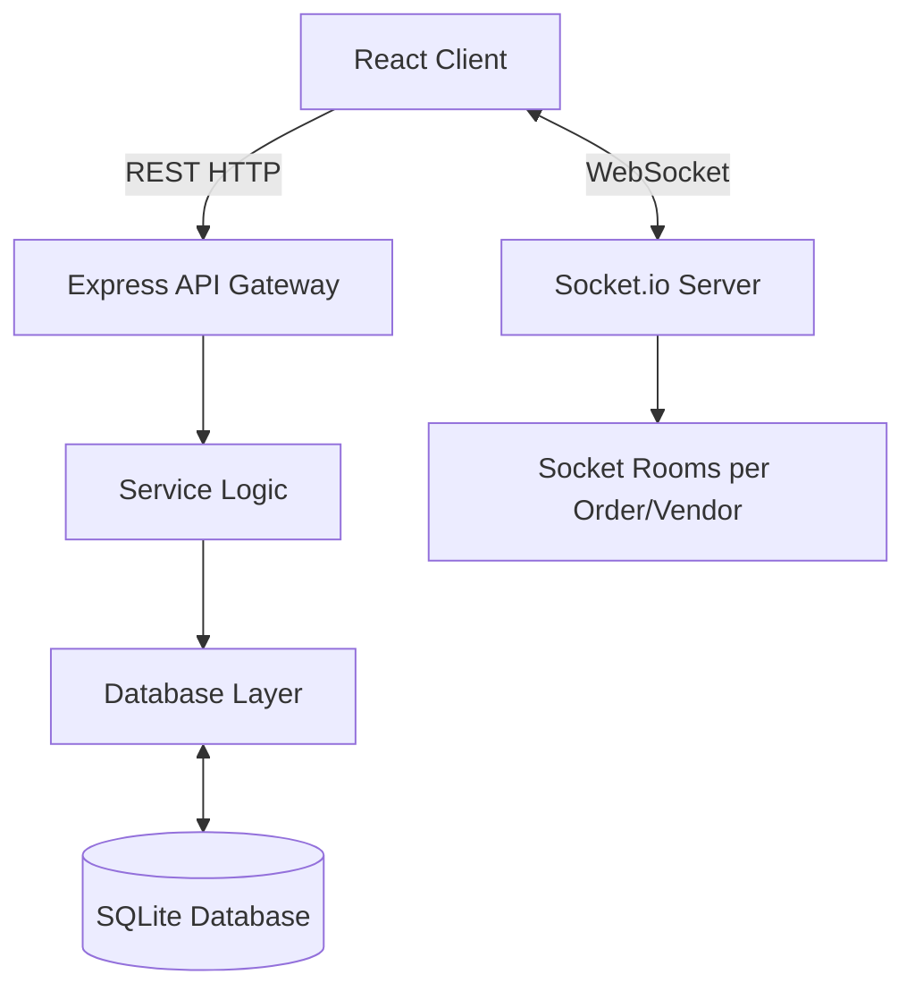

# CampusServe System Architecture

## Overview
CampusServe utilizes a **3-tier architecture**:
1.  **Presentation Tier**: React.js SPA (Vite)
2.  **Logic Tier**: Node.js / Express REST API Server + Socket.io Server
3.  **Data Tier**: SQLite Relational Database

## Data Flow

## Scalability & Future Improvements
While currently using SQLite for portability, the data layer utilizes standard SQL syntax making migration to **PostgreSQL** or **MySQL** trivial.

**For a production release at scale:**
- Change DB to PostgreSQL.
- Offload session management & caching to Redis.
- Use a Message Queue (like RabbitMQ) to handle heavy order load reliably during lunch rushes.
- Deploy Delivery Agent sockets as a separate microservice to isolate high-frequency location ping traffic.
